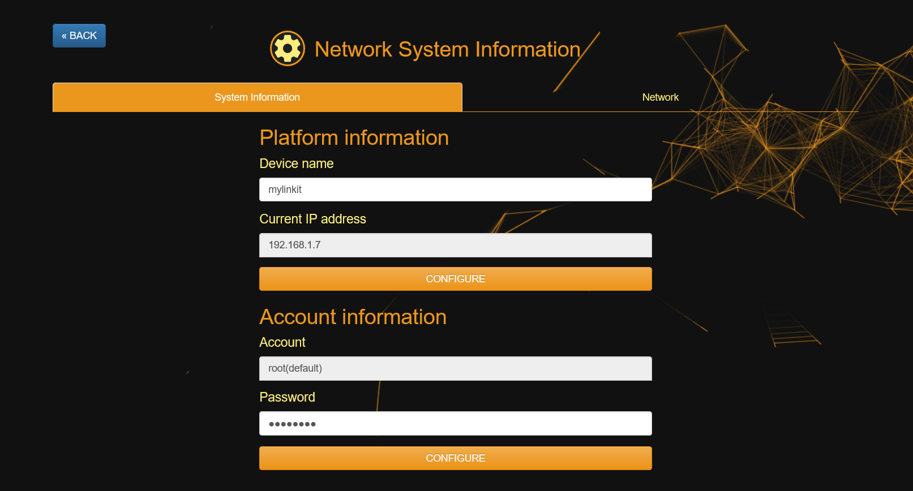
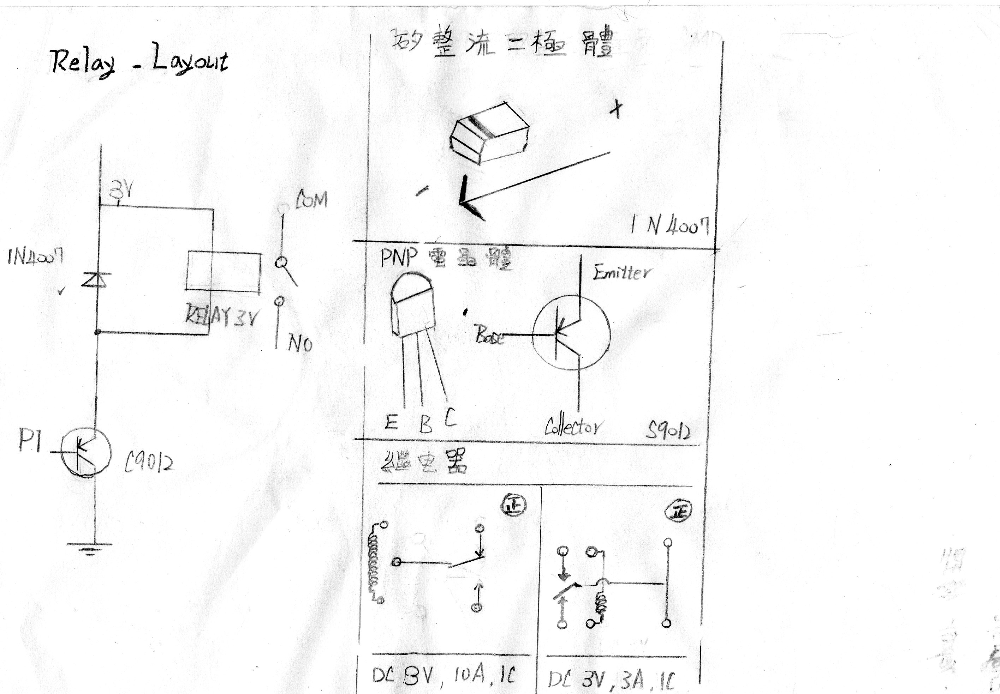
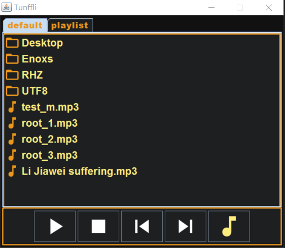
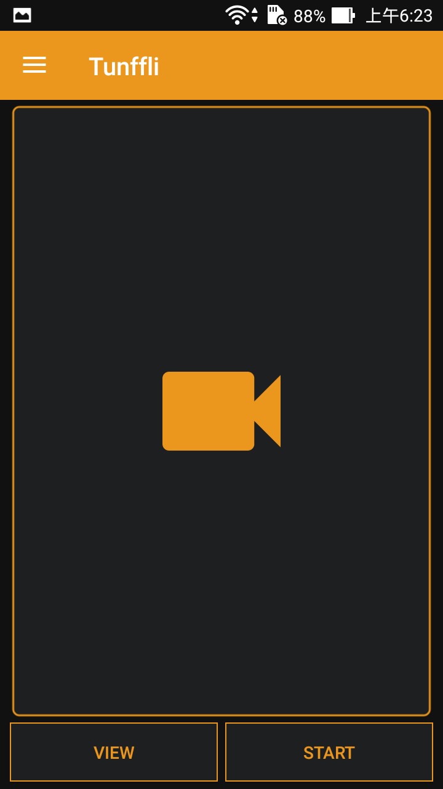

智慧家居系統 - Tunffli
======
藉由搭建傳感器資料傳輸系統的經驗，使用繼電器結合學習到的電子焊接技術建置智慧家居系統，目標很簡單: 把電燈關掉 (turn off the light)，這就是專案名稱的由來。

於 Linkit Smart 7688 開發板 ，Linux OpenWrt 的路由作業系統中，運行 Python 服務，透過 MQTT 消息傳輸協議，同步網頁畫面，視窗程式與手機應用各介面上的訊息，同時也可以反向控制板子達成電燈開關、攝影機視訊串流、音樂播放等功能。

+ 獨立開發
+ 習得技能
    + Python - Flask 輕量級網頁框架
    + Web - Bootstrap 前端框架
    + Android - MQTT 傳輸協議
    + Android - 攝影機視訊串流
    + Java - Swing 視窗程式
    + Java - 攝影機視訊串流
    + 電子焊接，繼電器元件使用
+ 功能項目
    + 開關控制
    + 音樂播放
    + 攝影機視訊串流
+ 程式介面
    + 網頁: Bootstrap + jQuery + Ajax
    + 視窗程式: Java Swing
    + 手機程式: Android
+ 專案連結
    + GitHub - <https://github.com/RHZEnoxs/Tunffli>
    + Web Demo - <https://rhzenoxs.github.io/Tunffli-View/>

### 網頁伺服器
輕量級 Python Flask 框架後端建置，Bootstrap + jQuery + Ajax 前端實作。

#### Python/  
+ tunffli_main.py 為 Tunffli 主程序，於系統開機時運行。
+ tunffli_flask.py 為 Python Flask 網頁框架主體，處理網路請求。

        FTP 上傳放置於 /www 資料夾下，以Python 指令啟動 tunffli_main.py

### 設計風格
黑色背景代表關掉電燈，橘黃色代表適合家居的暖白光，加上隨著鼠標產生的三角漣漪，成為整體系統設計的主要元素

+ 鼠標三角漣漪
    + <https://github.com/nightheronry/AES_WEB>

### 網頁路由設定
覆寫聯發科物聯網實驗室開源範例，自定義系統與網路界面，可設定裝置名稱、登錄密碼與網路連接模式。

+ linkit-smart-7688-webUI
    + <https://github.com/MediaTek-Labs/linkit-smart-7688-webUI>

#### 開關控制
Python Library - mraa 控制 GPIO 硬體介面，切換繼電器開關。

### 繼電器
開關繼電器使用如下電路圖 與 IC 元件組合而成。 繼電器規格 DC 3V，二極體用來保護繼電器，電晶體則用來保護晶片接腳。

### 音樂播放

Python 運行子線程執行 madplay 指令播放音樂。

### 攝影機視訊串流
Python 運行子線程執行 mjpg_streamer指令，啟動網路攝影機，透過影像串流功能，各裝置介面可瀏覽即時影像畫面。

### Java 視窗程式
Java Swing 實作功能介面，MQTT 傳輸協議參考 IBM Mqtt 範例 paho-mqtt，攝影機視訊串流部份未實作，僅開啟指定網頁頁面。

+ paho-mqtt
    + <https://eclipse.org/paho/>

### Android 應用程式
Android 實作功能介面

+ MQTT 傳輸參照 MQTT Example
    + <https://github.com/agoransson/mqtt4android>
+ Webcam 功能參照 ipcam-view
    + <https://github.com/niqdev/ipcam-view>

